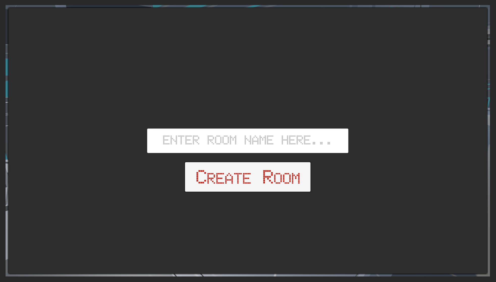
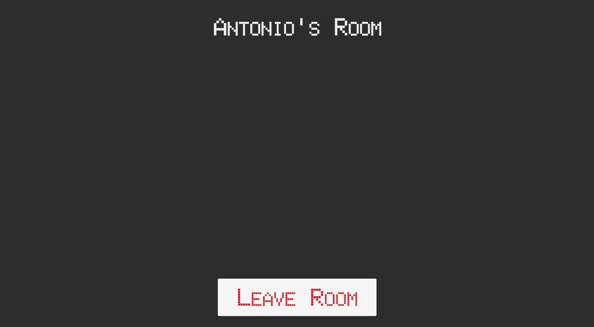
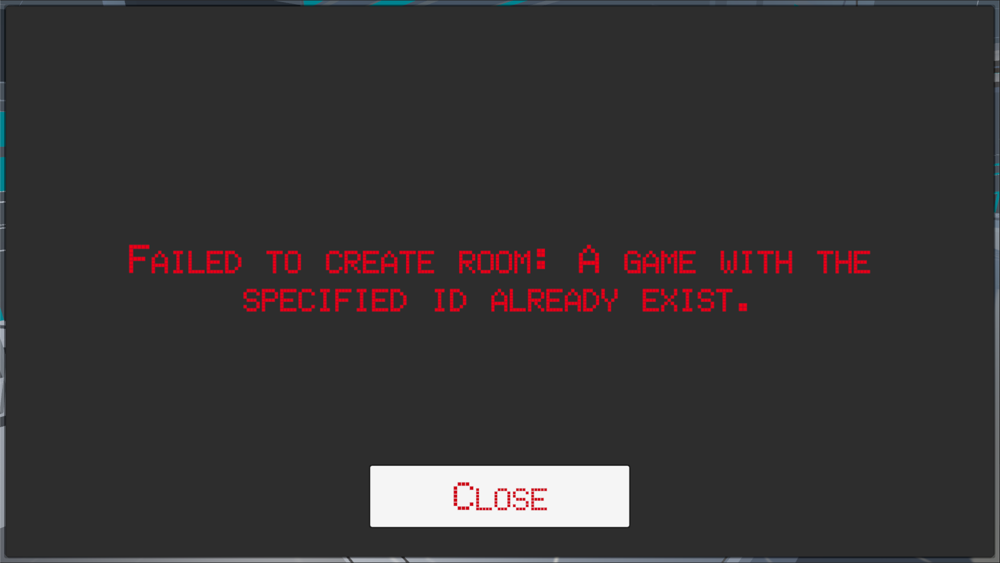

# Get Connected

## [Setting Up Photon](https://www.udemy.com/course/unity-online-multiplayer/learn/lecture/25987962#questions)

- Install PUN2 from the Unity Asset Store: https://assetstore.unity.com/packages/tools/network/pun-2-free-119922
- Before importing into our project, de-select the demo checkboxes
- Create an account here: https://www.photonengine.com/
- Create a new app and note the `app id`. This will be required as part of the PUN setup in Unity.
- Under `Assets/Photon/PhotonUnityNetworking/Resources/PhotonServerSettings`, change `Fixed Region` to `us`

## [Laying Out The Connection Menu](https://www.udemy.com/course/unity-online-multiplayer/learn/lecture/25987964#questions)

- Create a new scene for the main menu and save it in the `scenes` folder as `main menu`.
- Set up the basic buttons for the menu by creating a UI canvas, renaming it to `menu canvas`, and adjusting the canvas settings to scale with screen size.
- Add a title text to the top of the canvas to display the name of the game.
- Create buttons for the menu system by adding UI button elements and customizing their appearance, size, and position.
- Convert the button into a prefab by dragging it into the prefabs folder. This allows for easy reuse of the button design in different scenes.
- Create additional buttons for different menu options such as `Find Room`, `Create Room`, and `Quit Game`. Customize the text and appearance of each button as needed.
- Organize the buttons using a Vertical Layout Group component in a parent object called `menu buttons`. Adjust the positioning and spacing of the buttons within the layout.
- Add a loading panel by creating a UI panel element. Customize the panel's appearance, size, and position to display loading information.
- Add loading text to the loading panel using a UI TextMeshPro element. Customize the text appearance and positioning.
- Import a 3D model of a city as a background for the menu scene. Adjust the position and rotation of the camera to create a visually appealing view.
- Save the scene and proceed to the next steps, which will involve connecting the menu buttons to the actual game functionality.

## [Connecting To The Server](https://www.udemy.com/course/unity-online-multiplayer/learn/lecture/25987966#questions)

- Create a new script called `Launcher` and open it in the script editor.
- Make the launcher a static instance (`public static Launcher instance`).
- In the `Awake()` function, assign the instance to `this`.
- Import Photon Unity Networking by adding `using Photon.Pun` at the top of the script.
- Replace `MonoBehaviour` with `MonoBehaviourPunCallbacks`.
- Add references for the loading screen, menu buttons, and loading text (TeåxtMeshPro element).
- Create a void function called `CloseMenus()` to close any open menus.
- In the `Start()` function, close all menus, then set the loading screen active and update the loading text to say `Connecting to Network.`
- Connect to the Photon network using `PhotonNetwork.ConnectUsingSettings()`.
- Create a public override void function called `OnConnectedToMaster()`.
- In OnConnectedToMaster(), join the lobby using `PhotonNetwork.JoinLobby()` and update the loading text to say `Joining Lobby.`
- Remove the menu buttons activation code from `OnConnectedToMaster()` as it will be moved to another function.
- Create another override void function called `OnJoinedLobby()`.
- In `OnJoinedLobby()`, activate the menu buttons.

After completing these steps, you should have a basic networking system in place. When the game starts, it will display a loading screen with the text `Connecting to Network,` then briefly change to `Joining Lobby` before displaying the menu buttons. From this point, you can continue to implement creating and joining rooms for your game.

`Launcher.cs`

```cs
using System.Collections;
using System.Collections.Generic;
using UnityEngine;
using Photon.Pun;
using UnityEngine.UI;
using Unity.VisualScripting;
using TMPro;

public class Launcher : MonoBehaviourPunCallbacks
{
  public static Launcher instance;
  public GameObject loadingScreen;
  public TextMeshProUGUI loadingText;
  public GameObject menuButtons;

  private void Awake()
  {
    if (instance != null)
    {
      Destroy(gameObject);
      return;
    }
    instance = this;
    DontDestroyOnLoad(gameObject);
  }

  // Start is called before the first frame update
  void Start()
  {
    CloseMenus();
    loadingScreen.SetActive(true);
    loadingText.text = "Connecting To Network...";

    PhotonNetwork.ConnectUsingSettings();
  }

  void CloseMenus()
  {
    loadingScreen.SetActive(false);
    menuButtons.SetActive(false);
  }

  public override void OnConnectedToMaster()
  {
    PhotonNetwork.JoinLobby();
    loadingText.text = "Joining Lobby...";
  }

  public override void OnJoinedLobby()
  {
    CloseMenus();
    menuButtons.SetActive(true);
  }
}
```

## [Setting Up Room Creation](https://www.udemy.com/course/unity-online-multiplayer/learn/lecture/25987970#questions)

- Duplicate the existing `Loading Panel` and rename it to `Create Room Panel.`
- Open the new panel and remove the `loading text.`
- Add a `UI > Input Field - TextMeshPro` and rename it to `Room Name Input Field` to let users input the room's name.
- Set the input field's width to 800 and height to 100.
- Modify the placeholder text to guide the user (e.g., `enter room name here`) and adjust the font style and size.
- Center the text component and adjust its font style and size.
- Add a button to the panel, name it `Create Room` button, and position it appropriately.
- Deactivate the `Create Room Panel.`
- In the `Launcher` script, create references to the `Room Input Field` and the `Create Room Panel` by declaring two public variables.
- Add the `Create Room Panel` to the list of `closable menus.`
- Create a new function called `OpenRoomCreate()` to open the room creation screen and set the `Create Room panel` to active.
- In Unity, connect the `Create Room Panel` and the input field to the public variables in the script.
- Set up the `Create Room` button to call the `OpenRoomCreate()` function when clicked.
- Test the `room creation panel` in Unity by playing the game and clicking the `Create Room` button.

```cs
public GameObject createRoomScreen;
public TMP_InputField roomInputField;

void CloseMenus()
{
  //..
  createRoomScreen.SetActive(false);
}

public void OpenRoomCreate()
{
  CloseMenus();
  createRoomScreen.SetActive(true);
}
```



## [Creating A Room](https://www.udemy.com/course/unity-online-multiplayer/learn/lecture/25987972#questions)

- In the `Launcher` script, create a new function called "CreateRoom()"
- Save the script and assign the function to the "Create Room" button in Unity.
- Go back to the script and add an if statement to ensure that the player has entered a room name.
- Use the `string.IsNullOrEmpty()` function to check if the input field is empty.
- If the input field is not empty, call `PhotonNetwork.CreateRoom()` to create a new room with the player's input as the room name.
- To set a maximum number of players for the room, create a reference to the `RoomOptions` class. This requires adding `using Photon.Realtime;` at the top of the script.
- Create a `RoomOptions` variable called `options` and set it to a `new RoomOptions` instance.
- Set the maximum number of players for the room by assigning a value to options.MaxPlayers (e.g., `options.MaxPlayers = 8;`).
- Pass the `options` variable as a parameter when creating the room with `PhotonNetwork.CreateRoom()`.
- Close any open menus, set the loading text to `Creating Room`, and activate the loading screen.
- Save the script and test the room creation functionality in Unity.

```cs
using Photon.Realtime;

public void CreateRoom()
{
  if (!string.IsNullOrEmpty(roomInputField.text))
  {
    RoomOptions options = new RoomOptions();
    options.MaxPlayers = 8;
    PhotonNetwork.CreateRoom(roomInputField.text, options);
    CloseMenus();
    loadingText.text = "Creating Room...";
    loadingScreen.SetActive(true);
  }
}
```

## [Joining The Created Room](https://www.udemy.com/course/unity-online-multiplayer/learn/lecture/25987976#questions)

- Close the `Create Room` panel in the Unity editor.
- Duplicate the `Loading Panel`, and rename the new panel to `Room Panel.`
- Make the `Room Panel` visible.
- Modify the loading text to `Room Name Text,` move it to the top of the screen, and adjust its anchors accordingly.
- Add a UI button to the room panel, anchor it to the bottom, name it `Leave Button,` and set its text to `Leave Room.`
- In the `Launcher` script, create references to the room panel and room text.
- Add `public GameObject roomScreen` and `public TextMeshProUGUI `roomNameText` variables.
- In the same script, scroll down to the `Create Room` section, and create a new override method: `override void OnJoinedRoom()`. Remove the base method call, so only your custom functionality remains.
- Inside the `OnJoinedRoom()` method, first, close the menus by ensuring that `roomScreen.SetActive(false)` is called.
- Set `roomScreen.SetActive(true)` to make the room screen visible when the player joins the room.
- Update the room name text by setting `roomNameText.text = PhotonNetwork.CurrentRoom.Name;` This displays the name of the currently connected room.
- Save the script and return to the Unity editor to let it compile.
- Assign the `roomScreen` and `roomNameText` references in the `Launcher` script component within the Unity editor.
- Test the functionality by playing the Unity project. Enter a menu, create a room, and observe that the room is joined, displaying the room information on the room panel.

```cs
public GameObject roomScreen;
public TextMeshProUGUI roomNameText;

public override void OnJoinedRoom()
{
  CloseMenus();
  roomScreen.SetActive(true);
  roomNameText.text = PhotonNetwork.CurrentRoom.Name;
}
```



## [Handling Creation Errors](https://www.udemy.com/course/unity-online-multiplayer/learn/lecture/25987978#questions)

- Create an `Error Panel` by duplicating the `Loading Panel` and renaming it to `error panel.`
- Change the error panel's text to `Error Text` and set its color to `red` to indicate a warning.
- Add a `Close` button at the bottom of the error panel to allow users to close the error screen.
- In the `Launcher` script, add a `public GameObject errorScreen` and a `public TextMeshProUGUI errorText` for references to the error panel and its text.
- In the `CloseMenus()` function, add `errorScreen.SetActive(false);` to hide the error screen when other menus are closed.
- In the `Launcher` script, create an override method for handling room creation failure: `public override void OnCreateRoomFailed(short returnCode, string message)`
- Inside the `OnCreateRoomFailed()` method, set the error text to display the failure message: `errorText.text = "Failed to create room: " + message;`
- Close other menus and activate the error screen with `CloseMenus();` and `errorScreen.SetActive(true);`
- Create a new function to close the error screen and return to the main menu: `public void CloseErrorScreen().`
- In the `CloseErrorScreen()` function, call `CloseMenus();` and set the main menu buttons to be active: `menuButtons.SetActive(true);`
- In the Unity editor, assign the `CloseErrorScreen()` function to the `Close` button on the error panel.
- Assign the error panel and error text references in the `Launcher` script component within the Unity editor.
- Test the error handling functionality by running two instances of the game, creating a room with the same name in both instances, and ensuring the error message is displayed when room creation fails in the second instance.

```cs
public GameObject errorScreen;
public TextMeshProUGUI errorText;

public override void OnCreateRoomFailed(short returnCode, string message)
{
  errorText.text = "Failed to create room: " + message;
  CloseMenus();
  errorScreen.SetActive(true);
}

public void CloseErrorScreen()
{
  CloseMenus();
  menuButtons.SetActive(true);
}
```



## [Leaving A Room](https://www.udemy.com/course/unity-online-multiplayer/learn/lecture/25987984#questions)

- In the `Launcher` script, create a new public function called `LeaveRoom()` which will be called when the leave button is clicked.
- In the `LeaveRoom()` function, tell Photon to leave the room with the following command: `PhotonNetwork.LeaveRoom();`
- Close the current menus by calling the `CloseMenus();` function.
- Update the loading text to inform the user that they are leaving the room: `loadingText.text = "Leaving Room...";`
- Set the loading screen to active by using `loadingScreen.SetActive(true);`
- Create a new public override function called `OnLeftRoom()` which will be called when Photon detects that the user has left the room.
- In the `OnLeftRoom()` function, close the current menus (which should include the loading menu) by calling `CloseMenus();`
- Set the main menu buttons to active by using `menuButtons.SetActive(true);`
- Save the script and return to the Unity editor.
- On the room panel, assign the `LeaveRoom()` function to the leave button's onClick event.
- Test the functionality by running the game, joining the lobby, creating a room, and then leaving the room. The loading screen should briefly appear, and the user should be returned to the main menu.

```cs
public void LeaveRoom()
{
  PhotonNetwork.LeaveRoom();
  CloseMenus();
  loadingText.text = "Leaving Room...";
  loadingScreen.SetActive(true);
}

public override void OnLeftRoom()
{
  CloseMenus();
  menuButtons.SetActive(true);
}
```
