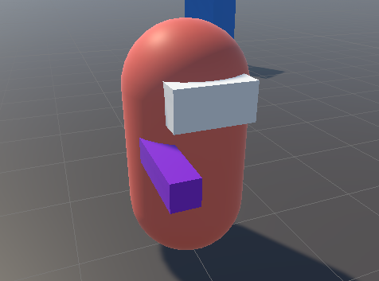
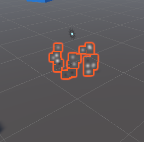

# Shooting & Weapons

## [Shooting](https://www.udemy.com/course/unity-online-multiplayer/learn/lecture/25987910#questions)

- In order for the `player` to shoot, add the following in the `PlayerController` script:

```cs
void Update() {
  // ..

  // Shoot if player left clicks
  if (Input.GetMouseButtonDown(0)) {
    Shoot();
  }

  // Handle the mouse in windowed mode
  // ..
}

private void Shoot() {
    // Create a new ray that goes from the center of the screen outwards.
    Ray ray = playerCamera.ViewportPointToRay(new Vector3(0.5f, 0.5f, 0f));

    // Set the origin of the ray to the position of the player's camera.
    ray.origin = playerCamera.transform.position;

    // If the raycast hits an object in the scene...
    // out passes by reference allowing 'hit' to be populated with return values
    if (Physics.Raycast(ray, out RaycastHit hit))
    {
        // ...output the name of the object to the console.
        Debug.Log("We hit " + hit.collider.gameObject.name);
    }
}
```

- Add a `cube` as a child of the `View Point` to represent the `Gun Placeholder`
- Add a `material` to the `Gun Placeholder`
- Remove the `Box Colliders` from both the `Goggles` and the `Gun Placeholder`



## [Creating Impact Effect](https://www.udemy.com/course/unity-online-multiplayer/learn/lecture/25987912#questions)

#### Bullet Impact

- Create a `quad` object in the game world to represent the bullet impact.
- Create a empty parent object called `Bullet Impact` and add the `quad` to it
- Duplicate the `quad` object and rotate it `180` degrees so quad has two sides
- Create a material for the quad called `Bullet Impact` and apply an image from the `Art` folder called `Bullet Impact` to it to give it a more realistic appearance.
- Change the `Rendering Mode` to `Fade`
- Apply the `material` to both sides of the `quads`
- Change the scale of the `Bullet Impact` to `(0.25, 0.25, 0.25)`


#### Particle System

- Right-click on the `Bullet Impact` object in the Hierarchy window and select `Effects` -> `Particle System` from the context menu. This will add a particle system component to the bullet impact object.
- In the Particle System component, change the `Start Size` to 0.1 to create small particles.
- Change the `Shape` to `Sphere` to create a circular impact area.
- Adjust the `Radius` to `0.01` to control the size of the impact area.
- Change the `Duration` to 1 to control how long the particles stay visible.
- Change the `Start Lifetime` to 1 to control how long each particle lasts.
- Change the `Start Speed` to a low value, such as 0.1, to make the particles move slowly.
- Under `Emission`, change the `Rate Over Time` to 0 to stop the particle system from continuously emitting particles.
- Under `Bursts`, click on the `+` button to add a burst of particles.
- Set the `Count` to 25 to create 25 particles in the burst.
- Change the `Start Color` to `Random Between Two Colors`.
- Choose a light gray color for the first color and a dark gray color for the second color to match the bullet impact material.
- Under `Size Over Lifetime`, click on the curve axis and select `Size` and select a curve that reduces the size over time to create a fading effect for the particles.
- Turn off the `Looping` option to ensure that the particle system only emits particles once.
- Save the bullet impact object as a prefab in the `Prefabs` folder so that it can be easily reused in the game.



## [Placing Impacts](https://www.udemy.com/course/unity-online-multiplayer/learn/lecture/25987914#questions)

- Create a public game object `bullet impact` reference in the `PlayerController` script.
- Make sure the `bullet impact` reference is assigned correctly on the player.
- In the shoot function, use the `instantiate` command to create a copy of the `bullet impact` game object.
- Set the position of the impact object to the hit point using the `hit.point` command.
- Set the rotation of the impact object to the surface normal using the `Quaternion.LookRotation(hit.normal, Vector3.up)` command.
- To prevent flickering, move the impact object slightly away from the surface using the `hit.normal * 0.002f` command.
- Destroy the impact object after a certain amount of time using the `Destroy(bulletImpactObject, 5f)` command.
- Remove the `mesh collider` from the impact object prefab to prevent layering of impact objects.

```cs
public GameObject bulletImpact;

private void Shoot()
{
  // ..

  if (Physics.Raycast(ray, out RaycastHit hit))
  {
    GameObject bulletImpactObject = Instantiate(bulletImpact, hit.point + (hit.normal * 0.02f), Quaternion.LookRotation(hit.normal, Vector3.up));
    Destroy(bulletImpactObject, 5f);
  }
}
```

## [Automatic Firing](https://www.udemy.com/course/unity-online-multiplayer/learn/lecture/25987916#questions)

- In the `PlayerController` script, add a public float variable named `timeBetweenShots` and a private float variable named `shotCounter`.
- Set the default value of `timeBetweenShots` to 0.1 (or any other desired value).
- In the shooting code section, after shooting a bullet, set `shotCounter` to `timeBetweenShots`.
- Check if the left mouse button is still being held down using the `GetMouseButton` function.
- If the left mouse button is still being held down, decrement `shotCounter` by `Time.deltaTime`.
- Check if `shotCounter` is less than or equal to zero. If it is, shoot a bullet again and set `shotCounter` back to `timeBetweenShots`.
- To avoid repeating code, use the `shoot()` function that was created earlier for shooting bullets.

```cs
public float timeBetweenShots = 0.1f;
private float shotCounter;

void Update() {
  //..

  // Check if left mouse button is still held down
  if (Input.GetMouseButton(0))
  {
      shotCounter -= Time.deltaTime;
      if (shotCounter <= 0)
      {
          Shoot();
          shotCounter = timeBetweenShots;
      }
  }
}

private void Shoot() {
  //..

  shotCounter = timeBetweenShots;
}
```

## [Weapon Overheating](https://www.udemy.com/course/unity-online-multiplayer/learn/lecture/25987918#questions)

- Open up the player controller script and add the following public floats at the top:
  - maxHeatValue: the maximum heat level that the gun can reach before overheating. Set it to 10.
  - heatPerShot: the amount of heat that is added to the gun's heat level every time a shot is fired. Set it to 1.
  - coolingRate: the rate at which the gun's heat level decreases when it's not being fired. Set it to 4.
  - overheatedCoolRate: the rate at which the gun's heat level decreases when it's overheated. Set it to 5.
- Add the following private variables:
  - heatCounter: a float that will keep track of the gun's current heat level.
  - overheated: a bool that will keep track of whether the gun is currently overheated or not.
- In the shoot function, add the following lines of code to increase the heat counter:
  - heatCounter += heatPerShot;
  - Check if heatCounter is greater than or equal to maxHeatValue. If it is, set heatCounter to maxHeatValue and set overheated to true.
- Before shooting, add a check to see if the gun is currently overheated. If it is, the gun cannot fire.
- After shooting, decrease the heatCounter by coolingRate \* Time.deltaTime if the gun is not overheated. If it is overheated, decrease it by overheatedCoolRate \* Time.deltaTime.
- Add a check to see if the heatCounter has decreased to zero. If it has, set overheated to false and set heatCounter to zero.
- Set up a way for the player to see the gun's heat level visually in the game. This can be done by creating a UI element that displays the heat level as a bar or number. Update the UI element every frame to reflect the current heat level.
- That's it! With these steps, you should have a functioning ammo system that prevents players from shooting forever and encourages tactical gameplay.

```cs
public float maxHeatValue = 10f;
public float heatPerShot = 1f;
public float coolingRate = 4f;
public float overheatedCoolRate = 5f;
private float heatCounter;
private bool overheated;

void Update()
{
  // ..

  if (!overheated)
  {
    // Shoot if player left clicks
    // ..
    heatCounter -= coolingRate * Time.deltaTime;
  }
  else
  {
    heatCounter -= overheatedCoolRate * Time.deltaTime;
    if (heatCounter < 0) overheated = false;
  }
  if (heatCounter < 0) heatCounter = 0f;

  //..
}

private void Shoot()
{
  //..

  heatCounter += heatPerShot;
  if (heatCounter >= maxHeatValue)
  {
      heatCounter = maxHeatValue;
      overheated = true;
  }
}
```
