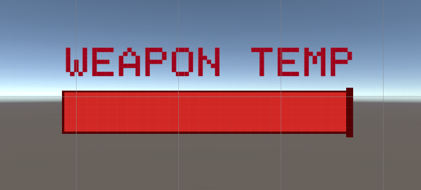
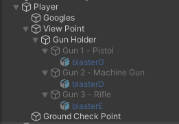

# Shooting & Weapons

## [Shooting](https://www.udemy.com/course/unity-online-multiplayer/learn/lecture/25987910#questions)

- In order for the `player` to shoot, add the following in the `PlayerController` script:

```cs
void Update() {
  // ..

  // Shoot if player left clicks
  if (Input.GetMouseButtonDown(0)) {
    Shoot();
  }

  // Handle the mouse in windowed mode
  // ..
}

private void Shoot() {
    // Create a new ray that goes from the center of the screen outwards.
    Ray ray = playerCamera.ViewportPointToRay(new Vector3(0.5f, 0.5f, 0f));

    // Set the origin of the ray to the position of the player's camera.
    ray.origin = playerCamera.transform.position;

    // If the raycast hits an object in the scene...
    // out passes by reference allowing 'hit' to be populated with return values
    if (Physics.Raycast(ray, out RaycastHit hit))
    {
        // ...output the name of the object to the console.
        Debug.Log("We hit " + hit.collider.gameObject.name);
    }
}
```

- Add a `cube` as a child of the `View Point` to represent the `Gun Placeholder`
- Add a `material` to the `Gun Placeholder`
- Remove the `Box Colliders` from both the `Goggles` and the `Gun Placeholder`


## [Creating Impact Effect](https://www.udemy.com/course/unity-online-multiplayer/learn/lecture/25987912#questions)

#### Bullet Impact

- Create a `quad` object in the game world to represent the bullet impact.
- Create a empty parent object called `Bullet Impact` and add the `quad` to it
- Duplicate the `quad` object and rotate it `180` degrees so quad has two sides
- Create a material for the quad called `Bullet Impact` and apply an image from the `Art` folder called `Bullet Impact` to it to give it a more realistic appearance.
- Change the `Rendering Mode` to `Fade`
- Apply the `material` to both sides of the `quads`
- Change the scale of the `Bullet Impact` to `(0.25, 0.25, 0.25)`


#### Particle System

- Right-click on the `Bullet Impact` object in the Hierarchy window and select `Effects` -> `Particle System` from the context menu. This will add a particle system component to the bullet impact object.
- In the Particle System component, change the `Start Size` to 0.1 to create small particles.
- Change the `Shape` to `Sphere` to create a circular impact area.
- Adjust the `Radius` to `0.01` to control the size of the impact area.
- Change the `Duration` to 1 to control how long the particles stay visible.
- Change the `Start Lifetime` to 1 to control how long each particle lasts.
- Change the `Start Speed` to a low value, such as 0.1, to make the particles move slowly.
- Under `Emission`, change the `Rate Over Time` to 0 to stop the particle system from continuously emitting particles.
- Under `Bursts`, click on the `+` button to add a burst of particles.
- Set the `Count` to 25 to create 25 particles in the burst.
- Change the `Start Color` to `Random Between Two Colors`.
- Choose a light gray color for the first color and a dark gray color for the second color to match the bullet impact material.
- Under `Size Over Lifetime`, click on the curve axis and select `Size` and select a curve that reduces the size over time to create a fading effect for the particles.
- Turn off the `Looping` option to ensure that the particle system only emits particles once.
- Save the bullet impact object as a prefab in the `Prefabs` folder so that it can be easily reused in the game.


## [Placing Impacts](https://www.udemy.com/course/unity-online-multiplayer/learn/lecture/25987914#questions)

- Create a public game object `bullet impact` reference in the `PlayerController` script.
- Make sure the `bullet impact` reference is assigned correctly on the player.
- In the shoot function, use the `instantiate` command to create a copy of the `bullet impact` game object.
- Set the position of the impact object to the hit point using the `hit.point` command.
- Set the rotation of the impact object to the surface normal using the `Quaternion.LookRotation(hit.normal, Vector3.up)` command.
- To prevent flickering, move the impact object slightly away from the surface using the `hit.normal * 0.002f` command.
- Destroy the impact object after a certain amount of time using the `Destroy(bulletImpactObject, 5f)` command.
- Remove the `mesh collider` from the impact object prefab to prevent layering of impact objects.

```cs
public GameObject bulletImpact;

private void Shoot()
{
  // ..

  if (Physics.Raycast(ray, out RaycastHit hit))
  {
    GameObject bulletImpactObject = Instantiate(bulletImpact, hit.point + (hit.normal * 0.02f), Quaternion.LookRotation(hit.normal, Vector3.up));
    Destroy(bulletImpactObject, 5f);
  }
}
```

## [Automatic Firing](https://www.udemy.com/course/unity-online-multiplayer/learn/lecture/25987916#questions)

- In the `PlayerController` script, add a public float variable named `timeBetweenShots` and a private float variable named `shotCounter`.
- Set the default value of `timeBetweenShots` to 0.1 (or any other desired value).
- In the shooting code section, after shooting a bullet, set `shotCounter` to `timeBetweenShots`.
- Check if the left mouse button is still being held down using the `GetMouseButton` function.
- If the left mouse button is still being held down, decrement `shotCounter` by `Time.deltaTime`.
- Check if `shotCounter` is less than or equal to zero. If it is, shoot a bullet again and set `shotCounter` back to `timeBetweenShots`.
- To avoid repeating code, use the `shoot()` function that was created earlier for shooting bullets.

```cs
public float timeBetweenShots = 0.1f;
private float shotCounter;

void Update() {
  //..

  // Check if left mouse button is still held down
  if (Input.GetMouseButton(0))
  {
      shotCounter -= Time.deltaTime;
      if (shotCounter <= 0)
      {
          Shoot();
          shotCounter = timeBetweenShots;
      }
  }
}

private void Shoot() {
  //..

  shotCounter = timeBetweenShots;
}
```

## [Weapon Overheating](https://www.udemy.com/course/unity-online-multiplayer/learn/lecture/25987918#questions)

- Open up the player controller script and add the following public floats at the top:
  - maxHeatValue: the maximum heat level that the gun can reach before overheating. Set it to 10.
  - heatPerShot: the amount of heat that is added to the gun's heat level every time a shot is fired. Set it to 1.
  - coolingRate: the rate at which the gun's heat level decreases when it's not being fired. Set it to 4.
  - overheatedCoolRate: the rate at which the gun's heat level decreases when it's overheated. Set it to 5.
- Add the following private variables:
  - heatCounter: a float that will keep track of the gun's current heat level.
  - overheated: a bool that will keep track of whether the gun is currently overheated or not.
- In the shoot function, add the following lines of code to increase the heat counter:
  - heatCounter += heatPerShot;
  - Check if heatCounter is greater than or equal to maxHeatValue. If it is, set heatCounter to maxHeatValue and set overheated to true.
- Before shooting, add a check to see if the gun is currently overheated. If it is, the gun cannot fire.
- After shooting, decrease the heatCounter by coolingRate \* Time.deltaTime if the gun is not overheated. If it is overheated, decrease it by overheatedCoolRate \* Time.deltaTime.
- Add a check to see if the heatCounter has decreased to zero. If it has, set overheated to false and set heatCounter to zero.
- Set up a way for the player to see the gun's heat level visually in the game. This can be done by creating a UI element that displays the heat level as a bar or number. Update the UI element every frame to reflect the current heat level.
- That's it! With these steps, you should have a functioning ammo system that prevents players from shooting forever and encourages tactical gameplay.

```cs
public float maxHeatValue = 10f;
public float heatPerShot = 1f;
public float coolingRate = 4f;
public float overheatedCoolRate = 5f;
private float heatCounter;
private bool overheated;

void Update()
{
  // ..

  if (!overheated)
  {
    // Shoot if player left clicks
    // ..
    heatCounter -= coolingRate * Time.deltaTime;
  }
  else
  {
    heatCounter -= overheatedCoolRate * Time.deltaTime;
    if (heatCounter < 0) overheated = false;
  }
  if (heatCounter < 0) heatCounter = 0f;

  //..
}

private void Shoot()
{
  //..

  heatCounter += heatPerShot;
  if (heatCounter >= maxHeatValue)
  {
      heatCounter = maxHeatValue;
      overheated = true;
  }
}
```

## [Overheated Indicator](https://www.udemy.com/course/unity-online-multiplayer/learn/lecture/25987922#questions)

- Set up the display resolution for the game to Full HD.
- Create a `Canvas` and set it up to match the Full HD resolution using Canvas Scalar as well as set `Match` to `Height`
- Add a `TextMeshPro` object to the canvas with the words `Weapon Overheated` and customize its appearance.
- Create a `UIController` script and attach it to the `Canvas`.
- In the `UIController` script, make in a `singleton` by creating a public static instance of the script and assign it to the UI controller object in the `Awake()` method.
- Use the `UIController` instance in other scripts to access the TextMeshPro object and modify its - appearance or visibility as needed.
- Add code to turn off the overheated message when the gun is no longer overheated.

`UIController.cs`

```cs
using System.Collections;
using System.Collections.Generic;
using TMPro;
using UnityEngine;

public class UIController : MonoBehaviour
{
    public static UIController Instance;
    public TextMeshProUGUI overheatedMessage;

    private void Awake()
    {
        if (Instance != null)
        {
            Destroy(gameObject);
            return;
        }
        Instance = this;
        DontDestroyOnLoad(gameObject);
    }
}
```

`PlayerController.cs`

```cs
void Update() {
  //..

  if (heatCounter < 0)
  {
      overheated = false;
      UIController.Instance.overheatedMessage.gameObject.SetActive(false);
  }
}

private void Shoot() {
  if (heatCounter >= maxHeatValue)
  {
      heatCounter = maxHeatValue;
      overheated = true;
      UIController.Instance.overheatedMessage.gameObject.SetActive(true);
  }
}
```

## [Displaying Current Weapon Heat](https://www.udemy.com/course/unity-online-multiplayer/learn/lecture/25987926#questions)

- Right-click on the `canvas`
- Add a `UI slider` and name it `Temp Slider`
- Remove the slide area and background from the `slider`
- Remove the source image for the fill and change its color to orange
- Drag the edges of the `slider` box to match the anchor points of the holder object
- Add a UI image to show the endpoint of the `slider`
- Add an outline to the `slider` and image
- Add a UI text to display the label `Weapon Temp`
- Set the anchor point of the `slider` to the bottom right corner
- Set the anchor point of the `text` to the bottom right corner
- Create a reference to the `slider` in the UI controller script
- In the `UIController` script, set the maximum value of the slider to be equal to the max heat value
- Update the value of the `slider` in the `UIController` script after handling the shooting and overheating
- Set the default value of the `slider` to zero on the canvas
- Play the game to see the `slider` in action.



## [Adding A Crosshair](https://www.udemy.com/course/unity-online-multiplayer/learn/lecture/25987928#questions)

- Open the Unity Editor and navigate to the `Canvas` in the Hierarchy window.
- Right-click on the `Canvas` and select `UI > Image` to add a new UI Image object to the `Canvas`.
- Rename the new object to `Crosshairs`.
- In the Inspector window, change the Source Image of the `Crosshairs` object to the desired crosshair image in the `Assets` folder.
- Set the `Anchor Presets` to the middle of the `Canvas` to keep the crosshairs centered.
- Set the color of the crosshairs to a darker color than white to make it more visible.
- Set the scale of the crosshairs to `2x2` to make it bigger and more visible.
- Adjust the position of the crosshairs as desired.
- Save the changes and run the game to see the new crosshairs in action.

## [Setting Up Multiple Weapons](https://www.udemy.com/course/unity-online-multiplayer/learn/lecture/25987930#questions)

- The next step is to add the ability to switch between weapons in the game.
- Start by setting up empty components on the player. Select the Viewpoint and right-click to create an empty child called `Gun Holder`. Create three more empty children called `Gun 1`, `Gun 2` and `Gun 3` under `Gun Holder`.
- Add three 3D models for each gun. Drag them from the `models` folder in the `assets`, and make them children of each gun. The 3D models should face the wrong way, so select each model and rotate them 180 degrees on the y-axis.
- Move the `Gun Holder` objects to the correct position, and move the guns slightly to the side.
- Create a new script in the scripts folder and name it `Gun`. Remove the `Start()` and `Update()` methods and add a `public bool isAutomatic`, a `public float timeBetweenShots = 0.1f`, and a `public float heatPerShot = 1f` that will be added with each shot. Save the script.
- Add the Gun script to each gun object and set the properties for each gun. The machine gun and rifle will be automatic, while the pistol will do 2 heat per shot. The rifle will fire slower and add more heat than the other guns.



`Gun.cs`

```cs
using System.Collections;
using System.Collections.Generic;
using UnityEngine;

public class Gun : MonoBehaviour
{
    public bool isAutomatic;
    public float timeBetweenShots = 0.1f;
    public float heatPerShot = 1f;
}
```

## [Switching Weapons](https://www.udemy.com/course/unity-online-multiplayer/learn/lecture/25987932#questions)

- In the player controller script, add a public gun array called `allGuns` and a private integer called `selectedGun`.
- In the Unity inspector, add the guns you want to use to the `allGuns` list.
- In the player controller script, in the Update function, add a conditional statement to check if the mouse scroll wheel is being scrolled up or down. If it's being scrolled up, increment the `selectedGun` value by one. If it's being scrolled down, decrement the `selectedGun` value by one.
- Add a new function called `switch gun` that deactivates all guns in the `allGuns` list except for the one selected by the `selectedGun` value.
- In the Update function, call the `switch gun` function after changing the `selectedGun` value.
- In the Start function, call the `switch gun` function to activate the first gun in the `allGuns` list.
- Play the game and use the scroll wheel to switch between guns.

```cs
public Gun[] allGuns;
private int selectedGun;

void Start() {
  //..

  SwitchGun()
}

void Update() {
  //..

  // Handle gun selection
  if (Input.GetAxisRaw("Mouse ScrollWheel") > 0f)
  {
    selectedGun++;
    if (selectedGun >= allGuns.Length) selectedGun = 0;
    SwitchGun()
  }
  if (Input.GetAxisRaw("Mouse ScrollWheel") < 0f)
  {
    selectedGun--;
    if (selectedGun < 0) selectedGun = allGuns.Length - 1;
    SwitchGun()
  }

  // Handle the mouse in windowed mode
  // ..
}

void SwitchGun()
{
  foreach(Gun gun in allGuns)
  {
      // Deactivate all guns
      gun.gameObject.SetActive(false);
  }
  // Activate the selected gun
  allGuns[selectedGun].gameObject.SetActive(true);
}
```

## [Making The Weapons Function Correctly](https://www.udemy.com/course/unity-online-multiplayer/learn/lecture/25987934#questions)

- Open the `PlayerController` script in the editor.
- Scroll down to the `Shoot()` function.
- Comment out any areas where default values are used by adding two slashes at the beginning of the line.
- Replace the default values with values from the `selectedGun` in the `allGuns` array. For example, instead of using the default `timeBetweenShots` value, get the `timeBetweenShots` value from the `selectedGun` in the `allGuns` array.
- Use the `isAutomatic` check to determine whether the player is allowed to continue firing.
- Save the changes to the script.
- Test the changes by playing the game and switching between the different weapons. Ensure that each weapon behaves differently in terms of firing rate and other attributes.

```cs
// public float timeBetweenShots = 0.1f;
// public float heatPerShot = 1f;

void Update() {
  //..

  // Check if left mouse button is still held down
  - if (Input.GetMouseButton(0)) { /*..*/ }
  + if (Input.GetMouseButton(0) && allGuns[selectedGun].isAutomatic) { /*..*/ }
}

void Shoot() {
  //..

  - shotCounter = timeBetweenShots;
  + shotCounter = allGuns[selectedGun].timeBetweenShots;

  - heatCounter += heatPerShot;
  + heatCounter += allGuns[selectedGun].heatPerShot;
}
```

## [Muzzle Flashes](https://www.udemy.com/course/unity-online-multiplayer/learn/lecture/25987938#questions/14662242)

- Open the Models folder and drag the Muzzle Flash model into the scene at position (0,0,0).
- Make the Muzzle Flash a child of each gun model (e.g. Pistol, Machine Gun, Rifle) and rotate it 180 degrees.
- Assign each Muzzle Flash object to a public GameObject variable in the gun script, e.g. `public GameObject muzzleFlash`.
- Deactivate all Muzzle Flash objects by default in the scene.
- Add a `public float muzzleDisplayTime` as well as a `private float muzzleCounter`
- In the `Shoot()` method, activate the Muzzle Flash when shooting a gun as well as reset the muzzleCounter:

```cs
allGuns[selectedGun].muzzleFlash.SetActive(true);
muzzleCounter = muzzleDisplayTime;
```

- Add a timer to automatically deactivate the Muzzle Flash after a short period of time:

```cs
if (allGuns[selectedGun].muzzleFlash.activeInHierarchy)
{
    muzzleCounter -= Time.deltaTime;
    if (muzzleCounter <= 0) allGuns[selectedGun].muzzleFlash.SetActive(false);
}
```

- Assign a value to the `muzzleDisplayTime` variable, which determines how long the Muzzle Flash stays active. You can calculate this value based on your target frame rate, e.g. `1 / 60` for a 60 fps game.
- Add a line of code to deactivate the Muzzle Flash whenever switching to a new weapon

```cs
void SwitchGun() {
  //..
  allGuns[selectedGun].muzzleFlash.SetActive(false);
}
```

- Test the game and adjust the Muzzle Flash timer and position as needed to achieve the desired effect.

## Code

#### Gun.cs

```cs
using System.Collections;
using System.Collections.Generic;
using UnityEngine;

public class Gun : MonoBehaviour
{
    public bool isAutomatic;
    public float timeBetweenShots = 0.1f;
    public float heatPerShot = 1f;
    public GameObject muzzleFlash;
}
```

#### PlayerController.cs

```cs
using System.Collections;
using System.Collections.Generic;
using UnityEngine;

public class PlayerController : MonoBehaviour
{
    public Transform viewPoint;
    public float mouseSensitivity = 1f;
    private float verticalRotStore;
    private Vector2 mouseInput;

    public bool invertLook;

    public float moveSpeed = 5f;
    public float runSpeed = 8f;
    private float activeMoveSpeed;
    private Vector3 moveDir, movement;

    public CharacterController characterController;
    private Camera playerCamera;

    public float jumpForce = 12f;
    public float gravityModifier = 2.5f;

    public Transform groundCheckpoint;
    private bool isGrounded;
    public LayerMask groundLayers;

    public GameObject bulletImpact;
    // public float timeBetweenShots = 0.1f;
    private float shotCounter;

    public float maxHeatValue = 10f;
    // public float heatPerShot = 1f;
    public float coolingRate = 4f;
    public float overheatedCoolRate = 5f;
    private float heatCounter;
    private bool overheated;

    public float muzzleDisplayTime;
    private float muzzleCounter;

    public Gun[] allGuns;
    private int selectedGun;

    // Start is called before the first frame update
    void Start()
    {
        // CursorLockMode.Locked value sets the lock state of the cursor to locked,
        // which hides the cursor and locks it to the center of the game window.
        Cursor.lockState = CursorLockMode.Locked;
        playerCamera = Camera.main;

        UIController.Instance.weaponTempSlider.maxValue = maxHeatValue;

        SwitchGun();
    }

    // Update is called once per frame
    void Update()
    {
        // Get the mouse input on the x and y axes and multiply it by a sensitivity value
        mouseInput = new Vector2(
            Input.GetAxisRaw("Mouse X"),
            Input.GetAxisRaw("Mouse Y")) * mouseSensitivity;

        // Set the rotation of the object to a new quaternion that has the same x and z angles as before,
        // but has the y angle increased by the mouse input on the x axis.
        transform.rotation = Quaternion.Euler(
            transform.rotation.eulerAngles.x,
            transform.rotation.eulerAngles.y + mouseInput.x,
            transform.rotation.eulerAngles.z);

        verticalRotStore = invertLook ? verticalRotStore - mouseInput.y : verticalRotStore + mouseInput.y;
        verticalRotStore = Mathf.Clamp(verticalRotStore, -60f, 60f);

        viewPoint.rotation = Quaternion.Euler(
            verticalRotStore,
            viewPoint.rotation.eulerAngles.y,
            viewPoint.rotation.eulerAngles.z);

        moveDir = new Vector3(Input.GetAxisRaw("Horizontal"), 0f, Input.GetAxisRaw("Vertical"));
        activeMoveSpeed = Input.GetKey(KeyCode.LeftShift) ? runSpeed : moveSpeed;

        float yVelocity = movement.y;
        movement = ((transform.forward * moveDir.z) + (transform.right * moveDir.x)).normalized * activeMoveSpeed;
        movement.y = yVelocity;

        // Reset the yVelocity if we are grounded
        if (characterController.isGrounded) movement.y = 0f;

        // Check if the player is grounded by using a Raycast
        isGrounded = Physics.Raycast(groundCheckpoint.position, Vector3.down, 0.25f, groundLayers);

        // Jumping
        if (Input.GetButtonDown("Jump") && isGrounded) movement.y = jumpForce;

        // Take into account gravity
        movement.y += Physics.gravity.y * Time.deltaTime * gravityModifier;
        characterController.Move(movement * Time.deltaTime);

        if (allGuns[selectedGun].muzzleFlash.activeInHierarchy)
        {
            muzzleCounter -= Time.deltaTime;
            if (muzzleCounter <= 0) allGuns[selectedGun].muzzleFlash.SetActive(false);
        }

        if (!overheated)
        {
            // Shoot if player left clicks
            if (Input.GetMouseButtonDown(0))
            {
                Shoot();
            }

            // Check if left mouse button is still held down
            if (Input.GetMouseButton(0) && allGuns[selectedGun].isAutomatic)
            {
                shotCounter -= Time.deltaTime;
                if (shotCounter <= 0)
                {
                    Shoot();
                }
            }

            heatCounter -= coolingRate * Time.deltaTime;
        }
        else
        {
            heatCounter -= overheatedCoolRate * Time.deltaTime;
            if (heatCounter < 0)
            {
                overheated = false;
                UIController.Instance.overheatedMessage.gameObject.SetActive(false);
            }
        }
        if (heatCounter < 0) heatCounter = 0f;

        UIController.Instance.weaponTempSlider.value = heatCounter;

        // Handle gun selection
        if (Input.GetAxisRaw("Mouse ScrollWheel") > 0f)
        {
            selectedGun++;
            if (selectedGun >= allGuns.Length) selectedGun = 0;
            SwitchGun();
        }
        if (Input.GetAxisRaw("Mouse ScrollWheel") < 0f)
        {
            selectedGun--;
            if (selectedGun < 0) selectedGun = allGuns.Length - 1;
            SwitchGun();
        }


        // Handle the mouse in windowed mode
        if (Input.GetKeyDown(KeyCode.Escape)) Cursor.lockState = CursorLockMode.None;
        else if (Cursor.lockState == CursorLockMode.None
            && Input.GetMouseButtonDown(0)) Cursor.lockState = CursorLockMode.Locked;

    }

    void LateUpdate()
    {
        playerCamera.transform.position = viewPoint.position;
        playerCamera.transform.rotation = viewPoint.rotation;
    }

    private void Shoot()
    {
        // Create a new ray that goes from the center of the screen outwards.
        Ray ray = playerCamera.ViewportPointToRay(new Vector3(0.5f, 0.5f, 0f));

        // Set the origin of the ray to the position of the player's camera.
        ray.origin = playerCamera.transform.position;

        // If the raycast hits an object in the scene...
        if (Physics.Raycast(ray, out RaycastHit hit))
        {
            // ...output the name of the object to the console.
            Debug.Log("We hit " + hit.collider.gameObject.name);

            GameObject bulletImpactObject = Instantiate(bulletImpact, hit.point + (hit.normal * 0.02f), Quaternion.LookRotation(hit.normal, Vector3.up));
            Destroy(bulletImpactObject, 5f);
        }

        shotCounter = allGuns[selectedGun].timeBetweenShots;

        heatCounter += allGuns[selectedGun].heatPerShot;
        if (heatCounter >= maxHeatValue)
        {
            heatCounter = maxHeatValue;
            overheated = true;
            UIController.Instance.overheatedMessage.gameObject.SetActive(true);
        }

        // Muzzle flash
        allGuns[selectedGun].muzzleFlash.SetActive(true);
        muzzleCounter = muzzleDisplayTime;
    }

    void SwitchGun()
    {
        foreach(Gun gun in allGuns)
        {
            // Deactivate all guns
            gun.gameObject.SetActive(false);
        }
        // Activate the selected gun
        allGuns[selectedGun].gameObject.SetActive(true);

        allGuns[selectedGun].muzzleFlash.SetActive(false);
    }
}
```

#### UIController.cs

```cs
using System.Collections;
using System.Collections.Generic;
using TMPro;
using UnityEngine;
using UnityEngine.UI;

public class UIController : MonoBehaviour
{
    public static UIController Instance;
    public TextMeshProUGUI overheatedMessage;
    public Slider weaponTempSlider;

    private void Awake()
    {
        if (Instance != null)
        {
            Destroy(gameObject);
            return;
        }
        Instance = this;
        DontDestroyOnLoad(gameObject);
    }
}
```
