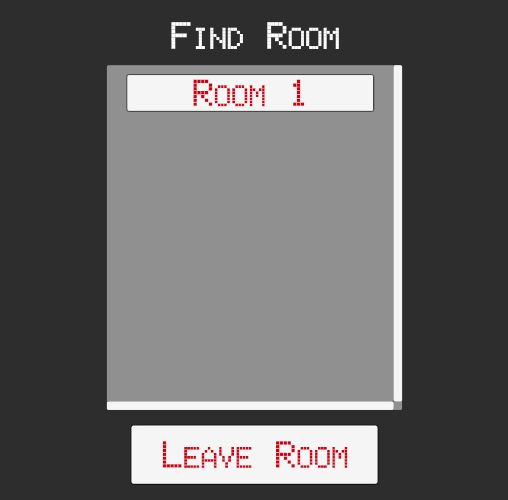
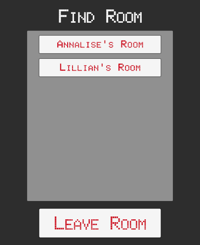
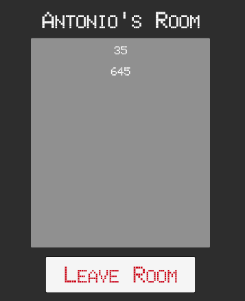

# Room Browsing, Nicknames & Starting a Game

## [Laying Out The Room Browser](https://www.udemy.com/course/unity-online-multiplayer/learn/lecture/25987986#questions)

- Duplicate the existing `Room Panel` and rename it to `Room Browser Panel`.
- Activate the `Room Browser Panel`, and update the title text to say `Find Room`.
- Create a scrollable area for the list of rooms by adding a `UI > ScrollView` component to the `Room Browser Panel`.
- Adjust the size of the `ScrollView` to your desired dimensions (e.g., `600w x 700h`).
- Locate the content area inside the ScrollView, and adjust its size to be larger than the full size of the ScrollView (e.g `1000`). This will activate the scrollbars.
- Increase the scroll sensitivity of the `ScrollView` to make it scroll faster (e.g., `100`).
- Customize the appearance of the vertical scrollbar, such as changing its color and disabling the image on the scrollbar background.
- Add a `Button` prefab to the `Content` area of the `ScrollView > Viewport`.
- Add a `Vertical Layout Group` component to the `Content` area to arrange the room buttons vertically with padding and spacing.
- Disable the `Force Expand Height` option in the `Vertical Layout Group` component.
- Add a `Content Size Fitter` component to the `Content` area and set it to `Vertical Fit: Min Size`. This will adjust the size of the `Content` area based on the number of buttons.
- Test the scrolling functionality by duplicating the room buttons and running the game. - Adjust the `ScrollView` settings as needed, such as changing the movement type to `Clamped` if you do not want the elastic bounce effect.



## [Making The Room Browser Work](https://www.udemy.com/course/unity-online-multiplayer/learn/lecture/25987988#questions)

- Create a new script named `RoomButton` in the scripts folder.
- Attach the `RoomButton` script to the room button GameObject in your game.
- Open the RoomButton script in a code editor and add the following code:

```cs
using System.Collections;
using System.Collections.Generic;
using UnityEngine;
using TMPro;
using Photon.Realtime;

public class RoomButton : MonoBehaviour
{
  public TextMeshProUGUI buttonText;

  private RoomInfo info;

  public void SetButtonDetails(RoomInfo inputInfo)
  {
    info = inputInfo;
    buttonText.text = info.Name;
  }
}
```

- Add the following code in the `Launcher` script to manage the rooms in the game:

```cs
public GameObject roomBrowserScreen;
public RoomButton theRoomButton;
private List<RoomButton> allRoomButtons = new List<RoomButton>();
private Dictionary<string, RoomInfo> cachedRoomsList = new Dictionary<string, RoomInfo>();

public void OpenRoomBrowser()
{
  CloseMenus();
  roomBrowserScreen.SetActive(true);
}

public void CloseRoomBrowser()
{
  CloseMenus();
  menuButtons.SetActive(true);
}

// This method is called when the room list is updated.
public override void OnRoomListUpdate(List<RoomInfo> roomList)
{
  // Update the cached room list with the new room list information.
  UpdateCachedRoomList(roomList);
}

// This method updates the cached room list based on the provided room list.
public void UpdateCachedRoomList(List<RoomInfo> roomList)
{
  // Iterate through the room list.
  for (int i = 0; i < roomList.Count; i++)
  {
    RoomInfo info = roomList[i];

    // If the room has been removed from the list, remove it from the cached room list.
    if (info.RemovedFromList)
    {
      cachedRoomsList.Remove(info.Name);
    }
    else
    {
      // Otherwise, update or add the room to the cached room list.
      cachedRoomsList[info.Name] = info;
    }
  }

  // Update the room list buttons with the updated cached room list.
  RoomListButtonUpdate(cachedRoomsList);
}

// This method updates the room list buttons based on the provided cached room list.
void RoomListButtonUpdate(Dictionary<string, RoomInfo> cachedRoomList)
{
  // Clean up existing room buttons.
  foreach (RoomButton rb in allRoomButtons)
  {
    Destroy(rb.gameObject);
  }
  allRoomButtons.Clear();
  theRoomButton.gameObject.SetActive(false);

  // Iterate through the cached room list and create new room buttons.
  foreach (KeyValuePair<string, RoomInfo> roomInfo in cachedRoomList)
  {
    // Instantiate a new room button and set its parent.
    RoomButton newButton = Instantiate(theRoomButton, theRoomButton.transform.parent);

    // Set the new button's details with the room information.
    newButton.SetButtonDetails(roomInfo.Value);

    // Activate the new button.
    newButton.gameObject.SetActive(true);

    // Add the new button to the list of all room buttons.
    allRoomButtons.Add(newButton);
  }
}
```

- In Unity, assign the `theRoomButton` and `roomBrowserScreen` GameObjects to their respective fields in the `Launcher` script component.
- Create functions to open and close the room browser in the Launcher script, then wire up the `Find Room` button to call the `OpenRoomBrowser()` function and the `Leave` button to call the `CloseRoomBrowser()` function.
- Test the game in Unity to ensure the room buttons are created, updated, and destroyed correctly when browsing available rooms.



## [Joining A Room](https://www.udemy.com/course/unity-online-multiplayer/learn/lecture/25987990#questions)

- In the `Launcher` script, create a new function called `JoinRoom()` that takes in a `RoomInfo` object as an argument called inputInfo. This function will handle the process of joining a room.
  In the `RoomButton` script, create another function called `OpenRoom()`. This function will tell the launcher script's instance to run the `JoinRoom()` function, passing in the stored information about the room that the user wants to join.
- Back in the `Launcher` script, within the `JoinRoom()` function, use the `PhotonNetwork.JoinRoom` method to join the room by passing in the room name from the `inputInfo` object: `inputInfo.Name`.
- After joining the room, close the open menus, update the loading text to `Joining Room`, and activate the loading screen.
- Now, go back to Unity, and on the `Room Browser Panel`, find the `Room Button` object under the `Content` object.
- Configure the `Room Button` object to run the `RoomButton.OpenRoom` function when clicked.
- Test the implementation by running two instances of the game, one within Unity and another using an older build of the game.
- Create a room in one instance and use the `Room Browser` in the other instance to find and join the room.
- Test the functionality of leaving and rejoining the room.

`Launcher.cs`

```cs
public void JoinRoom(RoomInfo inputInfo)
{
  PhotonNetwork.JoinRoom(inputInfo.Name);
  CloseMenus();
  loadingText.text = "Joining Room";
  loadingScreen.SetActive(true);
}
```

`RoomButton.cs`

```cs
 public void OpenRoom()
{
  Launcher.instance.JoinRoom(info);
}
```

## [Quiting The Game](https://www.udemy.com/course/unity-online-multiplayer/learn/lecture/25987992#questions)

- Open the `Launcher` script in your code editor.
- At the bottom of the `Launcher` script, add the following:

```cs
public void QuitGame()
{
  #if UNITY_EDITOR
  UnityEditor.EditorApplication.isPlaying = false;
  #endif
  Application.Quit();
}
```

## [Listing Players](https://www.udemy.com/course/unity-online-multiplayer/learn/lecture/25987994#questions)

- In Unity, make necessary changes to the room panel by duplicating the room browser panel and modifying it accordingly.
- Create a UI TextMeshPro object in the scroll view's content and name it `Player Name Label`. Make sure it's centered and deactivated by default.
- In the `Launcher` script, create references to the `playerNameLabel` object, a list of `TextMeshProUGUI` objects called `allPlayerNames`.
- Assign a random nickname to each player as they join the lobby by setting `PhotonNetwork.NickName` to a random number in string format.
- Create a new private function called `ListAllPlayers()` in the launcher script.
- Inside the `ListAllPlayers()` function, destroy any existing player name labels in the `allPlayerNames` list, then clear the list.
- Get the list of players in the room from `PhotonNetwork` and store it in a `Player` array called `players`.
- Loop through the `players` array and instantiate a `newPlayerLabel` for each player. - Set the text of the label to the player's nickname, activate the label, and add it to the `allPlayerNames` list.
- Call the `ListAllPlayers` function when a player joins a room.
- Assign the `playerNameLabel` object in Unity to the appropriate field in the `Launcher` script.
- Test the implementation by building and running the game. Check if the list of players updates correctly when a new player joins the room.
- To fix the issue of not seeing all the players when a new player joins, you need to update the list of players whenever a new player joins the room. To do this, override the `OnPlayerEnteredRoom` function in the `Launcher` script and call the `ListAllPlayers` function within it.

```cs
public TextMeshProUGUI playerNameLabel;
private List<TextMeshProUGUI> allPlayerNames = new List<TextMeshProUGUI>();

public override void OnJoinedLobby()
{
    //..

    // Generate a random nickname for a player
    PhotonNetwork.NickName = Random.Range(0, 1000).ToString();
}

public override void OnJoinedRoom()
{
  // ..
  ListAllPlayers();
}

private void ListAllPlayers()
{
  // Clear out existing players
  foreach(TextMeshProUGUI player in allPlayerNames)
  {
    Destroy(player.gameObject);
  }
  allPlayerNames.Clear();

  // Retrieve the current list of players and save to the array
  Player[] players = PhotonNetwork.PlayerList;
  for (int i = 0; i < players.Length; i++)
  {
    TextMeshProUGUI newPlayerLabel = Instantiate(playerNameLabel, playerNameLabel.transform.parent);
    newPlayerLabel.text = players[i].NickName;
    newPlayerLabel.gameObject.SetActive(true);
    allPlayerNames.Add(newPlayerLabel);
  }
}
```


